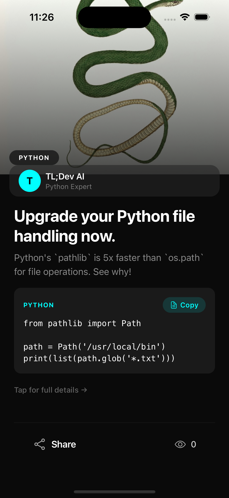

<div align="center">

# TL;Dev — Backend

**AI-autonomous engine that generates, curates, and delivers developer knowledge.**


</div>

---

<br>

## What it does

TL;Dev backend is a fully autonomous content pipeline. No editors. No manual curation.

AI generates real-world engineering tips sourced from companies like Netflix, Stripe, Discord, and Uber — complete with code snippets, summaries, and deep dives. Tips are scheduled via cron, pushed to devices, and served through a clean API.

The system runs itself.

<br>

## Architecture

```
Cron trigger
  → AI generates tips vercel ai gateway (Gemini / GPT)
  → Validated via Zod schemas
  → Stored in MongoDB via Prisma
  → Push notifications sent via Expo
  → Served to mobile app via REST API
```

<br>

## Stack

| Layer      | Tech                      |
| ---------- | ------------------------- |
| Framework  | Next.js (App Router)      |
| AI         | Gemini 2.0 Flash / GPT-4o |
| Database   | MongoDB + Prisma          |
| Push       | Expo Server SDK           |
| Validation | Zod                       |
| Deployment | Vercel                    |

<br>

## Setup

```bash
cp .env.example .env
npm install
npx prisma generate
npm run dev
```

<br>

## Next Plans

### Implement RAG pipeline for sourcing real-world engineering stories

### Implement MCP for AI content generation and articles summarization

### Add admin dashboard for monitoring and manual overrides

<br>

<div align="center">
<sub>Fully autonomous. Zero human intervention.</sub>
</div>
